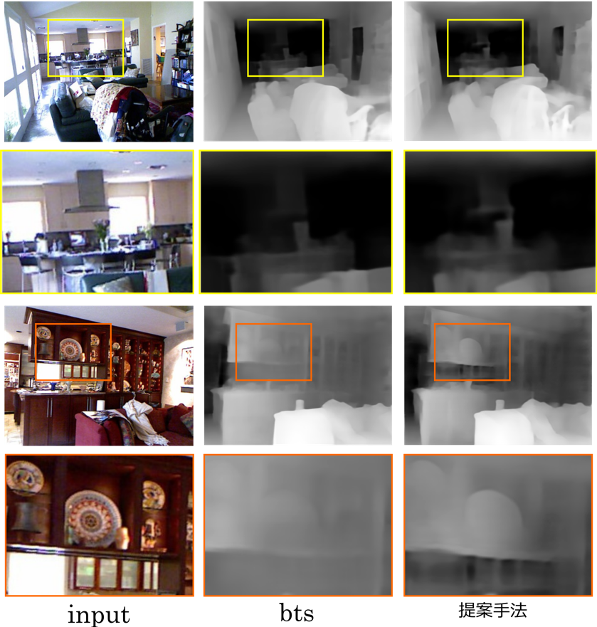
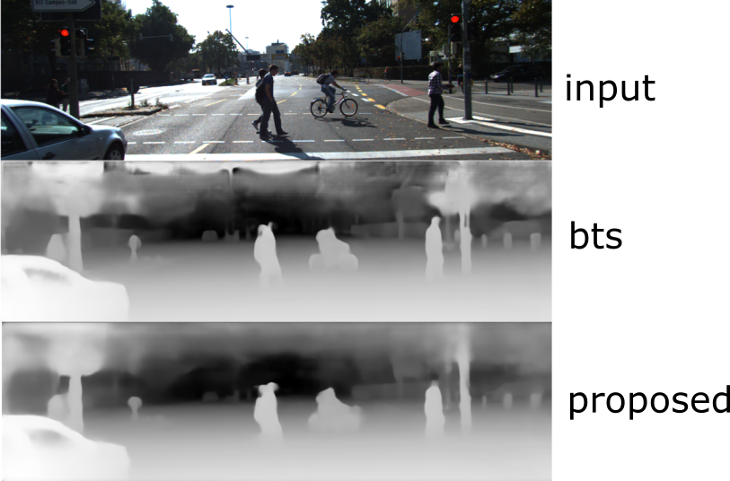
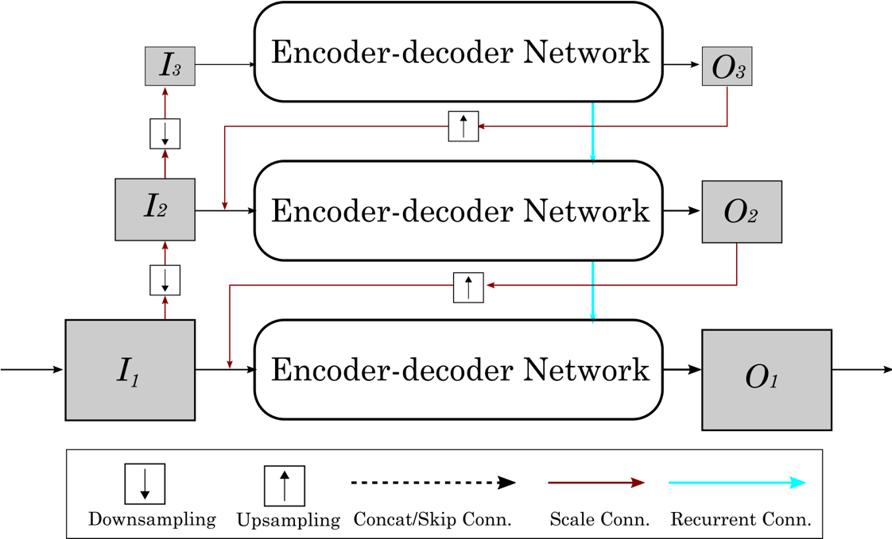
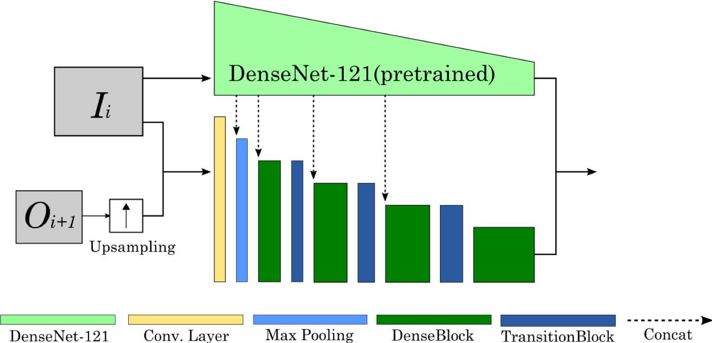
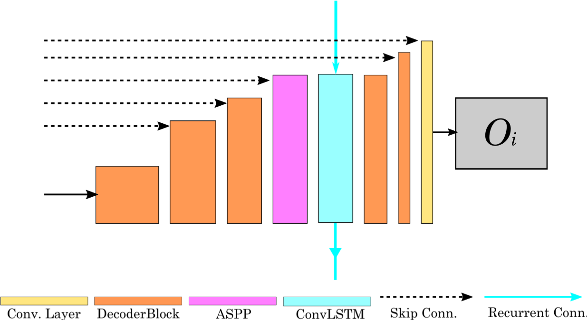

# Scale-recurrent network for monocular depth estimation

## output(indoor)

## output(outdoor)


## model
#### overall

#### encoder

#### decoder


## Prepare [NYU Depth V2](https://cs.nyu.edu/~silberman/datasets/nyu_depth_v2.html) test set
```shell
$ cd ~/workspace/srn/utils
### Get official NYU Depth V2 split file
$ wget http://horatio.cs.nyu.edu/mit/silberman/nyu_depth_v2/nyu_depth_v2_labeled.mat
### Convert mat file to image files
$ python extract_official_train_test_set_from_mat.py nyu_depth_v2_labeled.mat splits.mat ../../dataset/nyu_depth_v2/official_splits/
```
## Prepare [KITTI](http://www.cvlibs.net/download.php?file=data_depth_annotated.zip) official ground truth depth maps
Download the ground truth depthmaps from this link [KITTI](http://www.cvlibs.net/download.php?file=data_depth_annotated.zip).\
Then,
```
$ cd ~/workspace/dataset
$ mkdir kitti_dataset && cd kitti_dataset
$ mv ~/Downloads/data_depth_annotated.zip .
$ unzip data_depth_annotated.zip
```

Follow instructions from one of the below implementations with your choice.

## Note
This folder contains a PyTorch implementation of SRN.\
We tested this code under python 3.6, PyTorch 1.4.0, CUDA 10.2

## Preparation for Training
### NYU Depvh V2
Download the dataset we used in this work.
```
$ cd ~/workspace/srn
$ python utils/download_from_gdrive.py 1AysroWpfISmm-yRFGBgFTrLy6FjQwvwP ../dataset/nyu_depth_v2/sync.zip
$ unzip sync.zip
```

Once the dataset is ready, you can train the network using following command.
```
$ cd ~/workspace/srn/pytorch
$ python srn_main.py arguments_train_nyu.txt
```

### KITTI
You can also train SRN with KITTI dataset by following procedures.
First, make sure that you have prepared the ground truth depthmaps from [KITTI](http://www.cvlibs.net/download.php?file=data_depth_annotated.zip).
If you have not, please follow instructions on README.md at root of this repo.
Then, download and unzip the raw dataset using following commands.
```
$ cd ~/workspace/dataset/kitti_dataset
$ aria2c -x 16 -i ../../srn/utils/kitti_archives_to_download.txt
$ parallel unzip ::: *.zip
```
Finally, we can train our network with
```
$ cd ~/workspace/srn/pytorch
$ python srn_main.py arguments_train_eigen.txt
```

## Evaluation
Following command will evaluate the prediction results for NYU Depvh V2.
```
$ cd ~/workspace/srn/pytorch
$ python ../utils/eval_with_pngs.py --pred_path result_srn_nyu_v2_pytorch_densenet161/raw/ --gt_path ../../dataset/nyu_depth_v2/official_splits/test/ --dataset nyu --min_depth_eval 1e-3 --max_depth_eval 10 --eigen_crop
```

## References
https://github.com/cleinc/bts